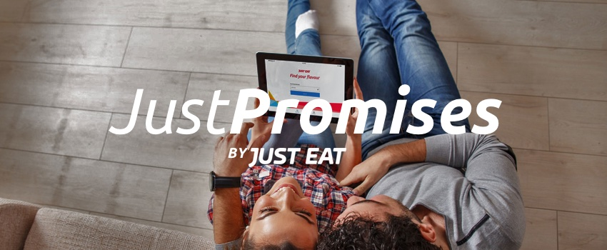

A lightweight and thread-safe implementation of Promises & Futures in Swift 3 for iOS, macOS, watchOS and tvOS with 100% code coverage.

#Overview

A Promise represents the future value of an asynchronous task. It can be intended as an object that acts as a proxy for a result that is initially unknown, usually because the computation of its value is yet incomplete.

Asynchronous tasks can succeed, fail or be cancelled and the resolution is reflected to the promise object.

Promises are useful to standardize the API of asynchronous operations. They help both to clean up asynchronous code paths and simplify error handling.

The main features of JustPromises for Swift are listed below.

1. Fully unit-tested and documented
2. Thread-safe
3. Clean interface
4. Support for chaining
6. Support for cancellation
7. Operation based
8. Generics used to better result typing

More information at [the Wikipedia page](http://en.wikipedia.org/wiki/Futures_and_promises).


##Importing

To import just the Swift version of JustPromises, in your Podfile:
```
pod 'JustPromises/Swift'
```

In your .swift files:
```
import JustPromises
```

##Usage of Promise

Please refer to the example Swift Playground to have an idea of how to use use Promises and chaining Promises together.


###API Overview

A Promise is an asynchronous operation that will enventually resolve a future state. A Promise's `futureState` property will start in an unresolved state, but at some point in the future will update that state to be either:

- Result: With some result value
- Error: Providing the relevant error
- Cancelled: `cancel()` was called before the Promise could complete.

`Promise` has a generic constraint that defines the type of result that is expected, for instance a promise that retrived an image from a network resource might have the type `Promise<UIImage>`.

A `Promise` is instantiated by providing a block which will be fired when the Promise is executing, and the promise itself is provided as a parameter for convenience.

```
let networkPromise = Promise<Data> { promise in

    let url = URL(string: "https://imgs.xkcd.com/comics/api_2x.png")!
    let fetchDataTask = session.dataTask(with: url) { (data, response, error) in

        switch (data, error) {

        case (let data?, _):
            promise.futureState = .result(data)

        case (nil, let error?):
            promise.futureState = .error(error)

        case (nil, nil):
            promise.futureState = .error(DownloadError.noResponseData)
        }
    }
    fetchDataTask.resume()
}
```

A `Promise` is an `Operation` subclass, and as such has all the power of `Operation` available, including reporting on execution state, can be added to queues, and have cross-queue dependancies set up. 

A `Promise` is created in a non executing state, and must be added to a queue to begin executing, this can be done using the `await` convenience methods.
```
networkPromise.await()
networkPromise.awaitOnMainQueue()
let queue = OperationQueue()
networkPromise.await(onQueue: queue)
```

###Continuation

Work can be done after a `Promise` has finished by using a continuation.

There are multiple ways that you can use a continuation:

- Provide a new Promise that uses the outcome of the previous Promise
- Provide a block to be executed if the Promise has a result (Further `Promise`s can be chained after this)
- Provide a block to be executed if the Promise has a error (Further `Promise`s can be chained after this)
- Provide a block to be executed once the promise is finished.

Each continuation will take an operation queue to perform on, by default it will use a shared background queue.


####Continue with next Promise
```
networkPromise.continuation { previousPromise in
    
    let nextPromise = Promise<UIImage> { promise in

        switch previousPromise.futureState {

        case .unresolved:
            promise.futureState = .unresolved

        case .cancelled:
            promise.futureState = .cancelled

        case .error(let error):
            promise.futureState = .error(error)

        case .result(let downloadedData):
            let image = UIImage(data: downloadedData)!
            promise.futureState = .result(image)
        }
    }
    return nextPromise
}
```

####Handle result and allow further chaining
```
networkPromise.continuationWithResult(onQueue: .main) { result in

    let image = UIImage(data: result)!
    // Show image

}.continuation { previousPromise in

    let nextPromise = Promise<UIImage> { networkPromise in
        // Transform the data in some way to produce different image ...
    }
    return nextPromise
}
```

####Handle error and allow further chaining
```
networkPromise.continuationWithError(onQueue: .main) { error in

    print(error)

}.continuation { previousPromise in

    let nextPromise = Promise<UIImage> { networkPromise in
        // Transform the data in some way to produce different image ...
    }
    return nextPromise
}
```

####Handle the outcome of the promise without further chaining
``` 
networkPromise.continuation(onQueue: .main) { promise in

    // Do something with outcome of promise

}

```

###Continuation from a group of Promises

You can also add a continuation on an array of `Promise`s, and in fact an array of any `Operation`s. This continuation can return a `Promise` to allow chaining of further `Promise`s, or just be a self contained block for execution.

####Continue Operation Array with new Promise
```
let promises: [Operation] = [fetchHousePricesPromise, fetchCrimeDataPromise]

let dataMergePromise = promises.continuation() {
    
    return Promise<CLLocation> { promise in
        
        // Calculation best value property location
        promise.futureState = .result(somewhere)
    }
}

```

####Continue Operation Array with Block
```
let promises: [Operation] = [parallelTask1, parallelTask2]

promises.continuation() {

    print("All tasks completed")
}

```

##Other implementations

These are some third-party libraries mainly used by the community.

- [PromiseKit](http://promisekit.org/)
- [Bolts-iOS](https://github.com/BoltsFramework/Bolts-iOS) (not only promises)
- [RXPromise](https://github.com/couchdeveloper/RXPromise)


##Contributing

We've been adding things ONLY as they are needed, so please feel free to either bring up suggestions or to submit pull requests with new GENERIC functionalities.

Don't bother submitting any breaking changes or anything without unit tests against it. It will be declined.

##Licence

JustPromises is released under the Apache 2.0 License.

- Just Eat iOS team
